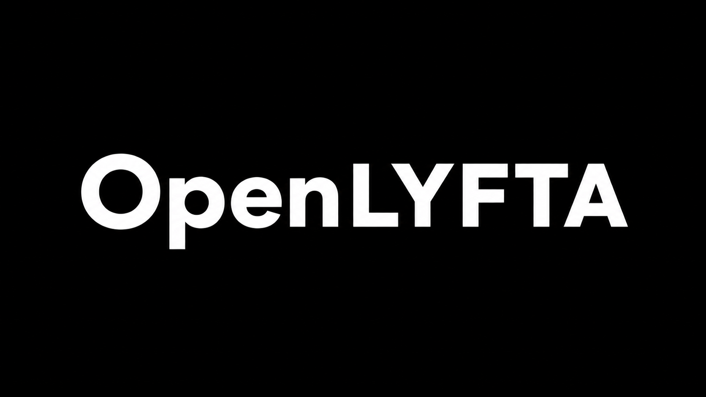

<div align="center">




Self-hosted mirror, share-card generator & Telegram auto-poster for the [Lyfta](https://lyfta.app) workout tracker.

</div>

---

## Features

- **Mirror your Lyfta data locally** — syncs all workout history, exercises, and sets into a local SQLite database
- **Share-card generation** — reproduces Lyfta's body-map muscle overlay locally using `sharp` (gender-aware: male/female body maps, with fallback)
- **Telegram auto-posting** — automatically sends share cards to your Telegram chat when new workouts sync, with configurable caption templates
- **Web dashboard** — browse workouts, view exercise/set details, regenerate cards, send to Telegram manually
- **Bulk history import** — sync your entire Lyfta history and send all past workouts to Telegram in one click
- **CloudFront exercise catalog** — auto-discovers and caches Lyfta's exercise catalog for muscle-ID mapping
- **User profile** — fetches your Lyfta profile (gender, weight, name) via `viewProfileGraph` API
- **Built-in log viewer** — timestamped application logs viewable in the web UI settings

## Quick Start

### Docker (recommended)

```bash
# 1. Create config directory
mkdir -p /opt/docker/openlyfta/data

# 2. Copy config files
cp .env.example /opt/docker/openlyfta/.env
cp Caddyfile /opt/docker/openlyfta/Caddyfile

# 3. Edit .env with your Lyfta credentials and admin password
nano /opt/docker/openlyfta/.env

# 4. Pull and run
docker pull wolfgirl/openlyfta:latest
docker run -d \
  --name openlyfta \
  -p 80:80 \
  -v /opt/docker/openlyfta/data:/data \
  -v /opt/docker/openlyfta/Caddyfile:/etc/caddy/Caddyfile:ro \
  --restart unless-stopped \
  wolfgirl/openlyfta:latest
```

Then open `http://localhost` in your browser and log in with your admin password.

### Docker Compose / Portainer

Use the included `docker-compose.yml`. In Portainer, create a new stack and paste:

```yaml
services:
  openlyfta:
    image: wolfgirl/openlyfta:latest
    container_name: openlyfta
    restart: unless-stopped
    ports:
      - "80:80"
    volumes:
      - /opt/docker/openlyfta/data:/data
      - /opt/docker/openlyfta/Caddyfile:/etc/caddy/Caddyfile:ro
```

### Local Development

```bash
npm install
cp .env.example .env
# Edit .env with your credentials
npm start
```

Server runs on `http://localhost:3000`.

## Configuration

All settings can be configured via environment variables (`.env`) or the web UI settings page:

| Variable | Description | Default |
|----------|-------------|---------|
| `LYFTA_EMAIL` | Your Lyfta account email | Required |
| `LYFTA_PASSWORD` | Your Lyfta account password | Required |
| `LYFTA_DEVICE_ID` | Device ID string (format: `manufacturer, model, android_ver`) | `samsung, SM-A127F, 13` |
| `LYFTA_DEVICE_TYPE` | Device type (`A` = Android) | `A` |
| `OPENLYFTA_ADMIN_PASSWORD` | Password to log into the web UI | Required |
| `PORT` | Port for the Express server (internal) | `3000` |
| `DATA_DIR` | Directory for SQLite DB + media | `/data` |
| `NO_AUTO_SYNC` | Set to `1` to skip initial sync on boot | `0` |

### Telegram Setup

1. Create a bot via [@BotFather](https://t.me/BotFather) and get the bot token
2. Get your chat ID (send a message to the bot, then visit `https://api.telegram.org/bot<TOKEN>/getUpdates`)
3. Enter both in the web UI under **Settings → Telegram**

### Caption Template Tokens

Use these tokens in your Telegram caption template:

| Token | Description |
|-------|-------------|
| `<date>` | Workout date |
| `<workoutname>` | Workout title |
| `<duration>` | Workout duration |
| `<volume>` | Total volume (raw kg) |
| `<volumeformatted>` | Total volume (formatted, e.g. `2.64t`) |
| `<totalsets>` | Total number of sets |
| `<exercises>` | Number of exercises |
| `<workoutnumber>` | Workout number |
| `<calories>` | Calories burned |
| `<bodyweight>` | Body weight |

## Architecture

```
┌─────────────┐     ┌──────────────────┐     ┌──────────────┐
│   Caddy     │───▶│  Express (Node)  │───▶│   SQLite     │
│  (port 80)  │     │  supervisord     │     │  (better-    │
│  reverse    │     │  ┌─────────────┐ │     │   sqlite3)   │
│  proxy      │     │  │ Sync engine │ │     └──────────────┘
└─────────────┘     │  │ (Lyfta API) │ │
                    │  └─────────────┘ │     ┌──────────────┐
                    │  ┌─────────────┐ │───▶│  Telegram    │
                    │  │ Card gen    │ │     │  Bot API     │
                    │  │ (sharp)     │ │     └──────────────┘
                    │  └─────────────┘ │
                    └──────────────────┘
```

- **Caddy** — reverse proxy, handles HTTP on port 80
- **Express** — web UI + REST API
- **Sync engine** — mirrors Lyfta API data, discovers CloudFront exercise catalog
- **Card generator** — composites body-map overlays + stats onto raw workout pictures using `sharp`
- **Telegram bot** — sends share cards with configurable captions

## First Run

On first login, the dashboard will show a welcome prompt asking if you'd like to sync your entire Lyfta workout history. You can choose to:
- **Sync history** — downloads all workouts from Lyfta
- **Sync & send to Telegram** — downloads all workouts and sends every share card to Telegram
- **Skip for now** — continue without bulk import

## Project Structure

```
app/
├── src/
│   ├── index.js              # Entrypoint: Express server, cron, auto-sync
│   ├── store.js              # SQLite schema + CRUD (workouts, exercises, profiles, logs)
│   ├── auth/session.js       # Session-based cookie auth
│   ├── lyfta/
│   │   ├── client.js         # Lyfta API client (login, feeds, exercises, profile, catalog)
│   │   └── sync.js           # Sync orchestrator (feed walk, backfill, catalog, profile)
│   ├── image/
│   │   ├── card.js           # Share-card generator (sharp composite + SVG overlays)
│   │   └── muscles.js        # Auto-generated muscle→drawable mapping (from APK)
│   ├── telegram/bot.js       # Telegram sendPhoto multipart sender
│   ├── lib/
│   │   ├── pipeline.js       # Orchestrates: sync → card gen → Telegram send
│   │   └── logger.js         # Logger wrapper (console + SQLite logs table)
│   └── routes/api.js         # REST API routes
├── public/
│   ├── index.html            # Dashboard GUI
│   ├── stickfigure.png       # OpenLyfta icon
│   ├── logo_text.png         # OpenLyfta text logo
│   └── favicon-32.png        # Favicon
├── assets/
│   ├── img/                  # Logo PNGs (stickfigure + text logo)
│   ├── font/                 # Google Sans TTF for card text rendering
│   └── bodymaps/             # Male + female muscle overlay webps (from Lyfta APK)
├── scripts/
│   └── build_muscle_map.js   # Reproducible APK parser for muscle enum extraction
├── test/
│   └── smoke-card.js         # Share-card generation smoke test
├── Dockerfile                # Single-image build (Node + Caddy + supervisord)
├── docker-compose.yml        # Docker Compose / Portainer deployment
├── Caddyfile                 # Caddy reverse proxy config (HTTP port 80)
├── supervisord.conf          # Process manager config (Caddy + Node)
├── .env.example              # Configuration template
└── .gitignore
```

## License

This project is for personal use. Lyfta is a trademark of its respective owners. OpenLyfta is not affiliated with or endorsed by Lyfta.
